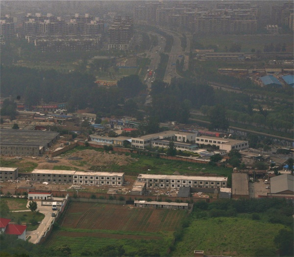
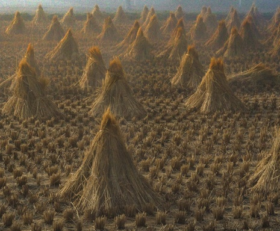

##Reimplement
##*DehazeNet: An End-to-End System for Single Image Haze Removal*
Bolun Cai, Xiangmin Xu, Kui Jia, Chunmei Qing, Dacheng Tao

##Requirement
> * caffe 
> * opencv2

##Usage:
simply type 
```shell
python DehazeNet.py image_path
```

##Demo:
<center>
<center>
<center>
<center>

##Site:
    @article{cai2016dehazenet,
        author = {Bolun Cai, Xiangmin Xu, Kui Jia, Chunmei Qing and Dacheng Tao},
        title={DehazeNet: An End-to-End System for Single Image Haze Removal},
        journal={arXiv preprint arXiv:1601.07661},
        year={2016}
    }